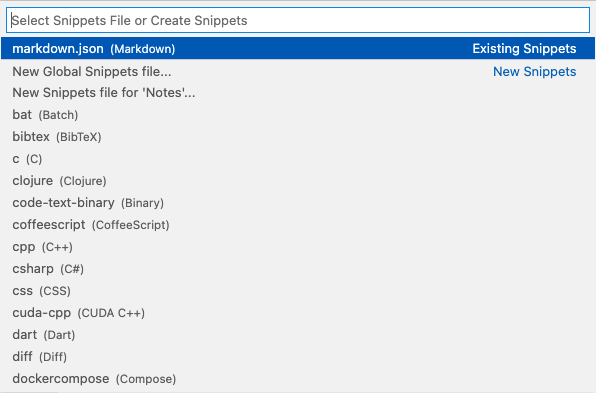

# Snippets in VSCode
- [Snippets in VSCode](#snippets-in-vscode)
- [Built-in snippets](#built-in-snippets)
- [Snippets Extensions](#snippets-extensions)
- [Custom Snippet 만들기](#custom-snippet-만들기)
  - [상단바에서 만들기](#상단바에서-만들기)
  - [Command Palette```⇧⌘P```(Shift + Cmd + P)](#command-palettepshift--cmd--p)
- [Snippet Scope](#snippet-scope)
  - [언어](#언어)
    - [1. **Single-language**](#1-single-language)
    - [2. **Multi-language, Global**](#2-multi-language-global)
  - [프로젝트](#프로젝트)
- [Snippet 문법](#snippet-문법)
  - [1. Tab Stops](#1-tab-stops)


IntelliSence(```⌃Space```) 혹은 Insert Snippet으로 파일에 스니펫을 추가할 수 있다.   
> prefix를 입력하는 도중에 cmd+space를 누르면 IntelliSense가 뜬다

스니펫 자동 완성
1. "editor.tabCompletion": "on" | "onlySnippets"
2. "editor.snippetSuggestions": "top"
3. snippet prefix 입력
4. Tab 누르기

[스니팻 Syntax](https://macromates.com/manual/en/snippets)   
> 단, [interpolated shell code](https://macromates.com/manual/en/snippets#interpolated_shell_code) 와 [```\u```](https://macromates.com/manual/en/snippets#transformations)는 지원하지 않음


# Built-in snippets
- 언어마다 미리 정의된 스니펫이 있다.

# Snippets Extensions
VS Code 확장 프로그램을 설치하면 개발자가 정의한 Snippets을 사용할 수 있다.

# Custom Snippet 만들기
## 상단바에서 만들기 
**Code** > **Preferences** > **Configure User Snippets**

## Command Palette```⇧⌘P```(Shift + Cmd + P)
CP에서 snippet 검색 후 Configure User Snippets 엔터



# Snippet Scope
1. 언어
2. 프로젝트

## 언어
모든 스니펫은 1, n, 혹은 모든 언어에서 사용할 수 있다.
  - language snippet file
  - global snippet file

### 1. **Single-language**
1개의 특정한 언어 스니펫 파일에 정의한다.
### 2. **Multi-language, Global**
"global" snippet files 안에 정의한다.(file의 suffix는 ```.code-snippets```)
파일 내에서 스니펫별로 scope property로 언어 scope를 추가로 정의할 수 있다.(정의하지 않으면 해당 스니펫은 모든 언어에서 사용 가능)   
Identifier는 [이곳](https://code.visualstudio.com/docs/languages/identifiers#_known-language-identifiers)을 참고

Value type of SCOPE Property == string : ```','.join(langauge_identifiers)```
```json
{
	"Details_Summary_list_params" : {
		"prefix" : ["pmdsp"],
		"body": [
			"<details open>",
			"<summary>${1:제목}</summary>\n",
			"* ${2:요소}\n",
			"</details>\n"
		],
		"description": "Markdown Detail Summary",
		"scope": "markdown,json"
	}
}
```

## 프로젝트
project 내에서 global snippets file을 작성할 수도 있다.   
이 때, 해당 설정 파일은 프로젝트 루트 > .vscode 폴더 내에 위치한다. Project snippet 파일을 프로젝트 구성원들이 공유할 수 있다는 장점이 있음.   
위와 동일한 방식으로 언어별 scope 설정이 가능하다.


# [Snippet 문법](https://code.visualstudio.com/docs/editor/userdefinedsnippets#_snippet-syntax)

## 1. Tab Stops
이어서...

<details open>
<summary>출처</summary>

* [VSCode 공식문서 Snippets](https://code.visualstudio.com/docs/editor/userdefinedsnippets)
* [VSCode 공식문서 Identifiers](https://code.visualstudio.com/docs/languages/identifiers)
* [Snippets_guide](https://www.freecodecamp.org/news/definitive-guide-to-snippets-visual-studio-code/)

</details>
